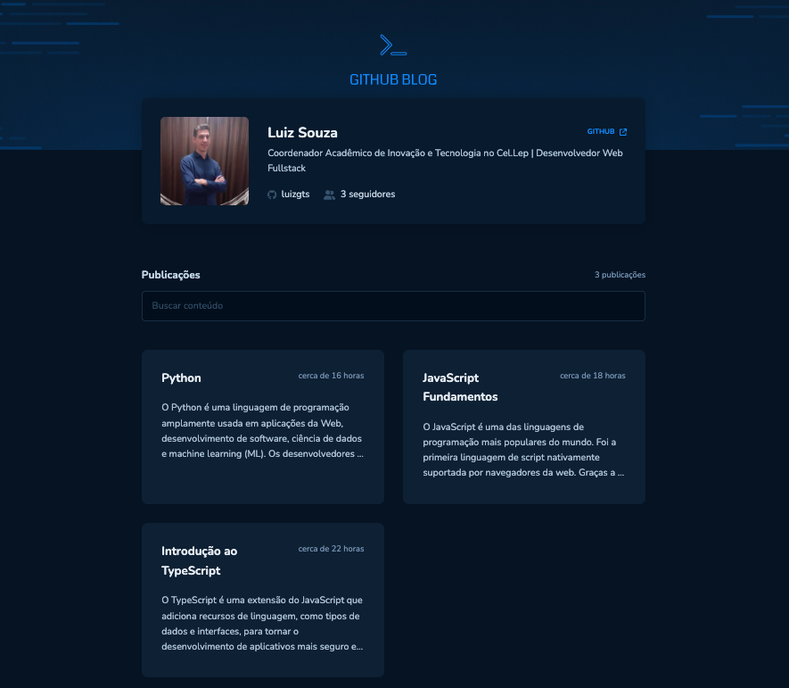

  <!-- Logo do Projeto -->
  

  <!-- Descrição curta -->
  
Um pequeno blog que utiliza APIs do Github como backend

  <!-- Links -->
  <a href="https://github.com/othneildrew/Best-README-Template">Ver demonstração</a>

<!-- Sobre o Projeto -->
## Sobre o Projeto

  

 

Este projeto faz parte dos desafios da trilha <b>ReactJS Ignite</b> do curso da <b>Rocketseat.</b> Trata-se de uma pequena aplicação frontend que utiliza algumas das APIs publicas do Github para buscar informações de perfil do usuário e issues que são utilizadas como postagens.

### Funcionalidades

- Página principal para exibição de informações do usuário e listagem de postagens (issues)
- Campo de busca para filtragem das postagens (issues)
- Página para exibição do conteúdo de uma postagem (issue)
- Build da aplicação automatizado (Netlify Build conectado ao repositório Git do projeto)

### Tecnologias Utilizadas

* ReactJS
* Typescript
* Vite
* Styled Components
* Icones do Font Awesome
* React Markdown
* Date FNS
* React Hook Form
* React Router Dom
* Zod
* Netlify
* Git & Github